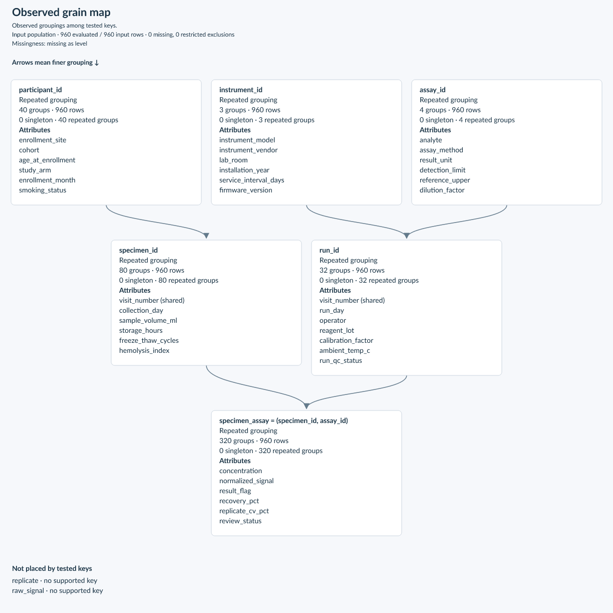

# Fieldwork

Make sense of unfamiliar tables before you start analyzing them. Fieldwork is a
Python toolkit for researchers working with pandas: see how records fit together,
investigate surprising patterns, and decide what to explore next.

A dataset often arrives as one large export, with repeated records, unevenly
filled columns, and little explanation of how it was assembled. Before choosing
what to count or compare, you need to understand what each row represents.
Fieldwork helps you build that understanding and follow what you find back to
the records themselves.

## See how the table fits together

A laboratory export might mix information about people, samples, instruments,
and measurements across dozens of columns. In the example below, those
relationships are buried in **960 rows and 43 columns**. Starting with identifiers
such as participant and specimen IDs, Fieldwork builds a map that helps you see
which details belong together and where repeated measurements enter the picture.



That gives you a starting point for deciding how to group the data, what to count,
and which records deserve a closer look.
[Try the laboratory example](examples/wide_table.py) to build this map yourself
from synthetic data.

## Follow the questions that emerge

- **Get your bearings.** Find groups of fields that appear together and identify
  how records repeat across the table.
- **Investigate a surprise.** Follow a pattern to the rows that support it or the
  exceptions that need explaining.
- **Narrow your focus.** Explore a particular site, group, or subset to understand
  how it differs from the rest of the data.
- **Build on what you learn.** Share findings and figures, save an investigation,
  and revisit it when the next delivery arrives.

## Start with your own data

```bash
pip install fieldwork
```

Load a table and get an overview of patterns worth exploring:

```python
import pandas as pd
import fieldwork as fw

df = pd.read_csv("your-data.csv")
overview = fw.explore(df)
print(overview)
```
For large tables, use `fw.explore(df, progress=True)` to see the current phase,
completed work, and elapsed time in a terminal or notebook.

Follow the [first investigation](https://fieldwork.beabm.dev/getting-started/)
to go from an overview to examining individual records, or work through the
[guided notebook](examples/investigation.ipynb). The
[documentation](https://fieldwork.beabm.dev/) covers the tools you can use as
your questions become more specific.

Fieldwork is an alpha release for Python 3.11–3.14, with pandas and NumPy as its
only required runtime dependencies.

For contributing and local setup, see the [developer documentation](docs/index.md).
Fieldwork is [MIT licensed](LICENSE); see [NOTICE](NOTICE) for project provenance.
